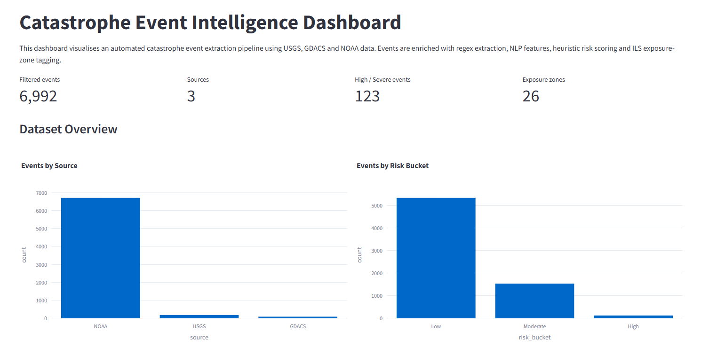
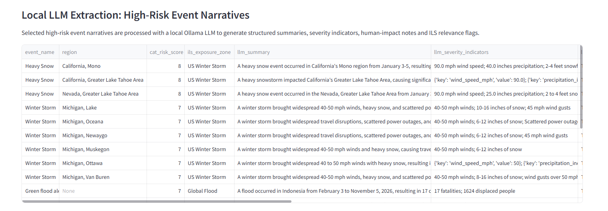
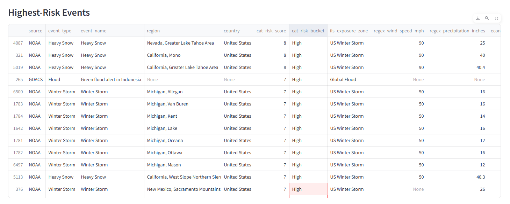
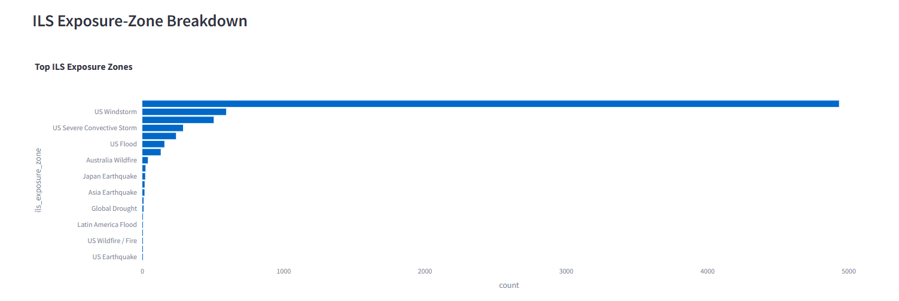
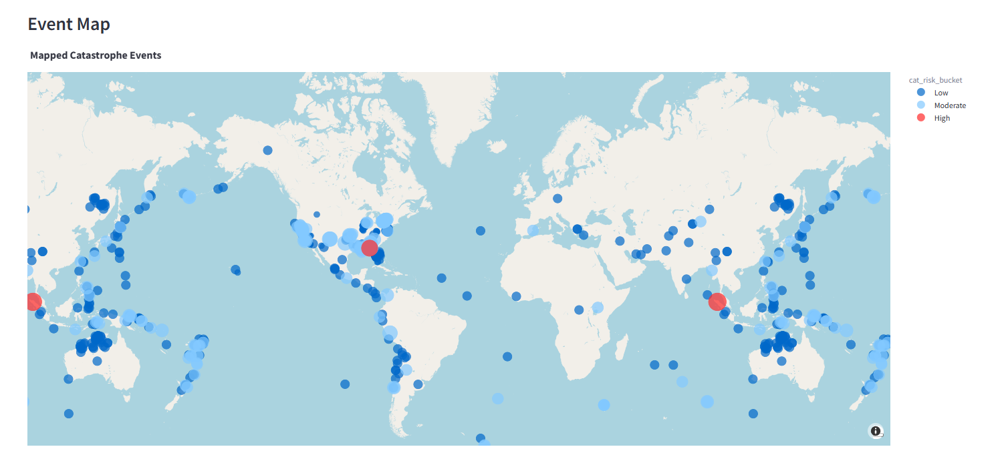

# Catastrophe Event Intelligence Pipeline for ILS Monitoring



## Project Summary

This project builds an end-to-end catastrophe event intelligence pipeline using Python. It ingests public catastrophe event data from USGS, GDACS, and NOAA, normalises the data into a common schema, extracts structured indicators from event narratives, scores event severity, tags ILS-relevant exposure zones, and visualises the results in a Streamlit dashboard.

The project is designed to demonstrate data engineering, automated extraction, NLP/LLM-assisted text analysis, SQL/database querying, and catastrophe-risk monitoring workflows relevant to Insurance-Linked Securities (ILS).

---

## Why This Matters for ILS

ILS and cat bond investors need to monitor natural catastrophe events across different public sources, formats, and regions. Public event data is fragmented: USGS provides structured earthquake data, GDACS provides live global disaster alerts, and NOAA provides detailed US storm-event records with long narrative descriptions.

This project shows how those sources can be combined into a structured monitoring workflow that identifies event type, location, severity indicators, and ILS-relevant exposure zones.

---

## Data Sources

The pipeline uses three public data sources:

| Source | Data Type | Use in Project |
|---|---|---|
| USGS Earthquake API | Live/recent earthquake event data | Global earthquake monitoring |
| GDACS RSS Feed | Live global disaster alerts | Floods, wildfires, earthquakes, volcanoes, droughts, and tropical cyclones |
| NOAA Storm Events | US storm-event records | Historical/latest US weather catastrophe narratives |

---

## Pipeline Architecture

```text
USGS API
GDACS RSS Feed
NOAA Storm Events CSV
        ↓
Raw data ingestion
        ↓
Common catastrophe event schema
        ↓
Regex extraction
        ↓
spaCy NLP extraction
        ↓
Risk scoring
        ↓
ILS exposure-zone tagging
        ↓
SQLite database export
        ↓
Streamlit dashboard
        ↓
Data quality and validation report
```

---

## Current Pipeline Output

The latest full pipeline run produced:

- Final dataset: `data/processed/final_catastrophe_event_dataset.csv`
- Rows: 6,992
- Columns: 34
- SQLite database: `data/processed/cat_events.db`
- Dashboard: `app/dashboard.py`

The final dataset includes:

- source
- event type
- event name
- country and region
- latitude and longitude where available
- start and end time
- magnitude and depth where relevant
- fatalities and injuries where available
- event description
- regex-extracted hazard indicators
- spaCy NLP entity outputs
- catastrophe risk score
- risk bucket
- ILS exposure-zone tag

---

## Features Extracted

### Regex Extraction

The project uses rule-based extraction to identify structured indicators from event narratives:

| Extracted Field | Example |
|---|---|
| Wind speed | 90 mph |
| Rainfall/snowfall/precipitation inches | 40.4 inches |
| Earthquake magnitude | Magnitude 5.6M |
| Earthquake depth | Depth: 63.665 km |
| Fatalities | 17 deaths |
| Injuries | 37 injuries |
| Displaced people | 1,624 displaced |
| Damage amounts | $25 million |

Regex fields are sparse by design because they capture peril-specific indicators only when explicitly mentioned in source narratives. Missing values usually mean the relevant metric was not present in the source text, not that extraction failed.

### spaCy NLP Extraction

The pipeline uses spaCy to extract:

- locations
- organisations
- dates
- cardinal numbers
- catastrophe-related keywords

**Example**

Description:

> A winter storm impacted the Greater Lake Tahoe Area from the 3rd to the 5th of January, producing 40.4 inches of snowfall and winds upwards of 90 mph.

Extracted outputs:

- Location: Greater Lake Tahoe Area
- Date: 3rd to 5th of January
- Keywords: winter storm, snow

### Local LLM-Assisted Extraction

The project includes a local LLM extraction layer using Ollama. This avoids external API cost and allows selected high-risk narratives to be converted into structured JSON.

The LLM extraction runs only on selected high-risk events and outputs:

- concise event summary
- affected locations
- broad peril type
- severity indicators
- human impact
- ILS relevance statement
- confidence score

**Example output**

Event: Heavy Snow, Greater Lake Tahoe Area

- LLM summary: A heavy snowstorm affected California's Greater Lake Tahoe Area, causing significant snowfall and strong winds.
- Severity indicators: 90 mph wind speed; 40.4 inches snowfall
- Investment relevance: Relevant for US winter storm exposure monitoring due to extreme snowfall and wind disruption.



---

## Catastrophe Risk Scoring

The project assigns each event a rule-based severity score using available hazard and impact indicators:

- event type
- earthquake magnitude
- wind speed
- rainfall/snowfall/precipitation inches
- economic damage
- fatalities
- injuries
- displaced people
- GDACS alert level

The score is then mapped into a risk bucket:

| Score Range | Bucket |
|---|---|
| 0–2 | Low |
| 3–5 | Moderate |
| 6–8 | High |
| 9+ | Severe |

**Important:** this is a heuristic prioritisation score, not a catastrophe loss model.



---

## ILS Exposure-Zone Tagging

The project maps events into broad ILS-relevant peril-region buckets, including:

- US Winter Storm
- US Severe Convective Storm
- US Windstorm
- US Flood
- US Heat / Drought
- US Hurricane / Tropical Storm
- Global Earthquake
- Japan Earthquake
- Australia Wildfire
- Global Flood

This makes the dataset more relevant for ILS monitoring because it moves beyond raw event labels and groups events by exposure categories.



---

## SQLite Database Layer

The final enriched dataset is exported into SQLite:

```
data/processed/cat_events.db
```

The database contains:

- `events` table
- `exposure_zone_summary` view
- `source_summary` view
- `high_risk_events` view

**Example SQL query**

```sql
SELECT
    ils_exposure_zone,
    COUNT(*) AS event_count,
    AVG(cat_risk_score) AS avg_risk_score
FROM events
GROUP BY ils_exposure_zone
ORDER BY event_count DESC;
```

The project also saves SQL query outputs to:

```
data/processed/sql_query_outputs/
```

Example outputs include:

- events by exposure zone
- events by source
- high-risk US Winter Storm events
- event types ranked by risk
- top 50 events by risk score

---

## Streamlit Dashboard

The Streamlit dashboard visualises the final dataset and allows filtering by:

- source
- event type
- risk bucket
- ILS exposure zone

Dashboard sections include:

- headline KPIs
- events by source
- events by risk bucket
- ILS exposure-zone breakdown
- event-type breakdown
- event map
- highest-risk events table
- raw filtered data explorer



Run the dashboard with:

```bash
streamlit run app/dashboard.py
```

---

## Data Quality and Validation

The project includes a data quality report:

```
data/processed/data_quality_report.txt
```

The report checks:

- row and column counts
- source breakdown
- missingness by column
- duplicate source-event IDs
- coordinate validity
- top event types
- risk bucket distribution
- ILS exposure-zone distribution
- regex extraction coverage
- NLP extraction coverage
- local LLM extraction results
- validation examples

**Latest report highlights**

- Rows: 6,992
- Columns: 34
- Duplicate `source-event_id` rows: 0
- Fully duplicated rows: 0
- Invalid latitude rows: 0
- Invalid longitude rows: 0

### Validation Example: NOAA Lake Tahoe Heavy Snow Event

One validation example is a NOAA Heavy Snow event in the Greater Lake Tahoe Area.

The event narrative describes a winter storm from the 3rd to the 5th of January, producing 1–2 feet of snow in the Tahoe Basin, 2–4 feet at higher elevations, ridge winds upwards of 90 mph, and 40.4 inches of snowfall at the Central Sierra Snow Lab.

The pipeline extracted:

- Event type: `Heavy Snow`
- ILS exposure zone: `US Winter Storm`
- Risk bucket: `High`
- Wind speed: 90 mph
- Precipitation/snowfall field: 40.4 inches

This validates that the pipeline can extract quantitative severity indicators from a NOAA narrative and classify the event into a relevant ILS exposure bucket.

---

## How to Run

### 1. Install dependencies

```bash
pip install -r requirements.txt
python -m spacy download en_core_web_sm
```

### 2. Run the full pipeline

```bash
python src/run_pipeline.py
```

### 3. Export to SQLite

```bash
python src/export_to_sqlite.py
```

### 4. Run local LLM extraction with Ollama

First install Ollama and pull the model:

```bash
ollama pull llama3.2:3b
```

Then run:

```bash
python src/llm_extract_ollama.py
```

### 5. Generate data quality report

```bash
python src/data_quality_report.py
```

### 6. Launch dashboard

```bash
streamlit run app/dashboard.py
```

---

## Project Structure

```text
cat_event_pipeline/
│
├── app/
│   └── dashboard.py
│
├── data/
│   ├── raw/
│   └── processed/
│
├── docs/
│   └── screenshots/
│
├── src/
│   ├── config.py
│   ├── fetch_usgs.py
│   ├── fetch_gdacs.py
│   ├── fetch_noaa.py
│   ├── normalise.py
│   ├── regex_extract.py
│   ├── nlp_extract.py
│   ├── risk_scoring.py
│   ├── exposure_tagging.py
│   ├── run_pipeline.py
│   ├── export_to_sqlite.py
│   ├── llm_extract.py
│   ├── llm_extract_ollama.py
│   └── data_quality_report.py
│
├── DASHBOARD_OVERVIEW.png
├── EVENT_MAP.png
├── HIGHEST_RISK_EVENTS.png
├── ILS_EXPOSURE_ZONES.png
├── LOCAL_LLM_EXTRACTION.png
├── requirements.txt
├── README.md
├── .env
└── .gitignore
```

---

## Limitations

- The catastrophe risk score is a rule-based prioritisation metric, not a catastrophe loss model.
- The project does not estimate actual insured losses, portfolio losses, or expected loss.
- NOAA latest-year files may be partial-year datasets, so row counts are not directly comparable with full historical years.
- The field currently named `regex_precipitation_inches` can capture both rainfall and snowfall values, so it should be interpreted as a generic precipitation/snowfall indicator for winter events.
- Local LLM outputs should be audited before use in any production workflow.
- Some NOAA records lack coordinates, which limits map coverage.
- The project focuses on event monitoring and extraction rather than cat bond pricing or reinsurance treaty modelling.

---

## Future Improvements

Possible extensions include:

- improve separation between rainfall and snowfall extraction
- add scheduled daily refresh
- add unit tests for regex, risk scoring, and exposure-zone tagging
- add more validation examples across USGS, GDACS, and NOAA
- add optional cloud deployment for the dashboard

---

## Relevance

This project demonstrates:

- Python data engineering
- public API/RSS/CSV ingestion
- automated data extraction
- NLP and local LLM-assisted text structuring
- SQL/database querying
- dashboarding and communication
- catastrophe-risk event monitoring
- ILS-relevant exposure-zone classification

It is intended to support roles involving ILS analytics, catastrophe-risk monitoring, data extraction, and quantitative development.

---

## Summary

This project demonstrates an end-to-end catastrophe event monitoring workflow relevant to ILS analytics. It ingests public catastrophe data from USGS, GDACS and NOAA, structures heterogeneous sources into a common schema, extracts hazard and impact indicators from event narratives using regex, spaCy NLP and a local LLM, stores enriched outputs in SQLite, and visualises risk scores and ILS exposure-zone tags in a Streamlit dashboard.

The project is not intended to be a catastrophe loss model. Instead, it is a data engineering and event-intelligence tool for monitoring, structuring and prioritising catastrophe events.
